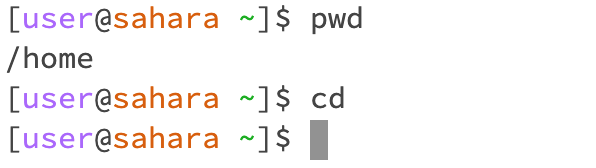
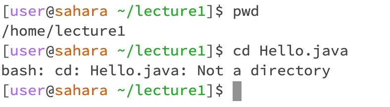
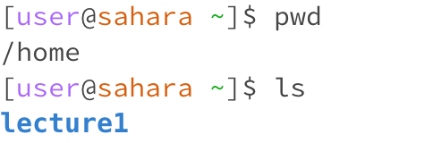
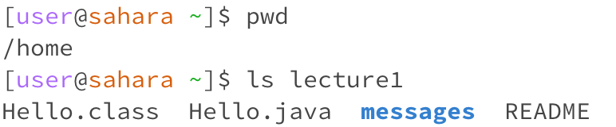
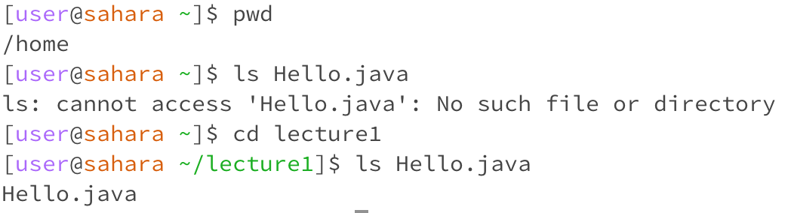
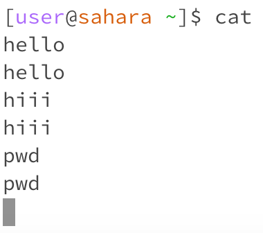
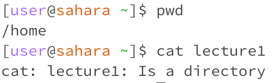
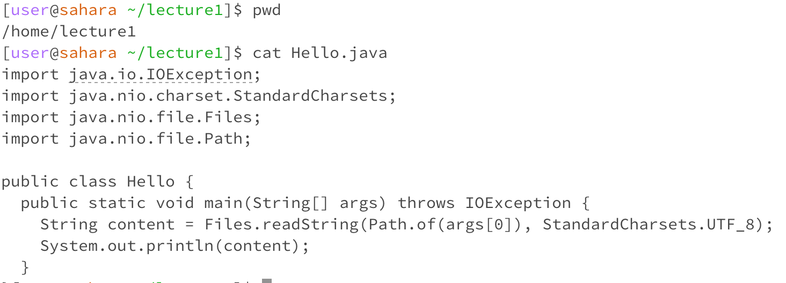

# Lab Report 1 - Remote Access and FileSystem (Week 1)

## cd
  1.

The command cd produces no output when used correctly in the terminal, so it makes sense that there's no output. The current directory remains the same since we used cd without any arguments. This output isn't an error.

  2.

This command produces no output but changes the current directory to lecture1. Since the argument was a directory, cd successfully changed the directory without any error.

  3.

This command results in an error because the argument isn't a directory. Since the 'cd' command is designed to switch the current directory, providing a filename as an argument triggers an error because it doesn't represent a directory that can be accessed.

## ls
  1. 

This command displays the names of the files and folders located within the current working directory, which, in this instance, was 'home.' Since no argument is provided, the command automatically prints the contents of the current directory. This output isn't an error.

  3. 

This command prints the names of the files and folders within the directory indicated, which was lecture1 in this case. There's no error in this output.

  5.

The command prints an error message when the filename isn't directly inside the current directory but prints the name of the file when the file is inside the current directory. For example, (in the picture above) "ls Hello.java" throws an error when the current directory is home because the file Hello.java is inside the folder lecture1. However, when the current directory is lecture1, "ls Hello.java" runs without an error and prints the filename. 

## cat
  1. 

  2. 

  3.

