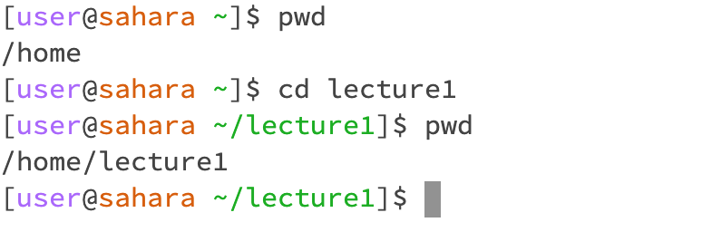

# Lab Report 1 - Remote Access and FileSystem (Week 1)

## cd
  1.

The command cd produces no output when used correctly in the terminal, so it makes sense that there's no output. The current directory remains the same since we used cd without any arguments. This output isn't an error.

  2.

This command produces no output but changes the current directory to lecture1. Since the argument was a directory, cd successfully changed the directory without any error.

  3.

This command results in an error because the argument isn't a directory. Since the 'cd' command is designed to switch the current directory, providing a filename as an argument triggers an error because it doesn't represent a directory that can be accessed.

## ls
  1. 

prints the names of the files and folders inside the current working directory, which was home in this case.

  3. 

prints the names of the files and folders within the directory.

  5.

error message when the filename isn't directly inside the current directory but prints the name of the file when the file is inside the current directory. 

## cat
  1. 
  2. 
  3.
