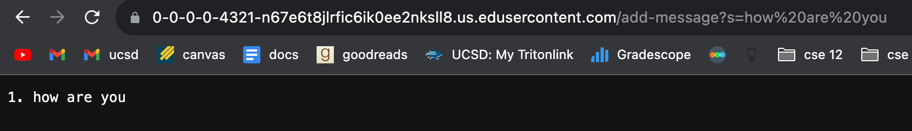

# Lab Report 2 - Servers and SSH Keys (Week 3)
## Part 1:
### Code for StringServer:


### examples:

The main method is initially called, which calls the ```Handler``` class, containing the ```handleRequest``` and ```addMessage``` methods. The relevant arguments in these methods are the ```url``` in ```handleRequest``` and ```message``` in ```addMessage```. The ```index``` is a relevant field of the class that incremented the number of the list by 1. In this example, ```index``` is initialized as 1 and is incremented only once at the end of ```addMessage``` since only one query is passed. So, although only 1 is printed, its value becomes 2 at the end of this iteration. The String ```message``` is also a relevant field of the class, which holds the value of ```parts[1]```, where ```parts``` is a list that organizes information within the query. Specific to this request, ```parts[1]``` equaled "how are you". Once the information is located and stored within ```parts```, the List ```messages```, which is also a relevant field, stores the formatted strings taken from different inputs and is used when the output is returned. In this case, the string "how are you" is stored in ```messages```.


In this request, the main method, ```handleRequest```, and ```addMessage``` methods were all called. The relevant arguments were the ```url``` in ```handleRequest``` and ```message``` in ```addMessage```. The ```index``` is a relevant field of the class, which was modified in this example and was incremented by 1 twice. Like the first example, the value of ```index``` was incremented to 2 at the end of the first request. However, since there were multiple requests, ```index``` became 3 after the second request. Additionally, ```message``` is still equal to ```parts[1]```, but has multiple values as the code runs since two queries are inputted in this example. At first, the value of ```message``` is "hello", and then it's "how are you". Since the first input "hello" contained no spaces, it didn't need to be further modified in the ```addMessage``` method. The List ```messages``` also expands in this example because of the two inputs. It stores both formatted messages "hello" and "how are you" within a list.

## Part 2:
screenshot of the path to the private key for my SSH key:


![Image](

## Part 3:
In the past few weeks of lab, I've learned how to use and work with many new commands in the terminal. One topic that really stood out to me was writing and running the servers since doing that was completely new to me. Running the website on the ieng6 server was very interesting. Also, before these few weeks, I had no idea what was stored in URLs or how they were formatted. 
