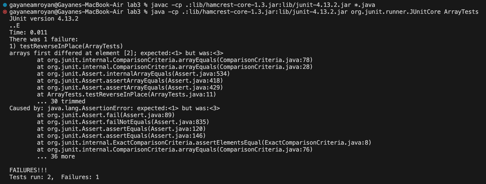

# Lab Report 3 - Bugs and Commands (Week 5)
## Part 1 - Bugs
One of the bugs from week 4's lab was the implementation of ```reverseInPlace```:
```
  static void reverseInPlace(int[] arr) {
    for(int i = 0; i < arr.length; i += 1) {
      arr[i] = arr[arr.length - i - 1];
    }
  }
```

### A failure-inducing input for the buggy program:
```
  @Test
  public void testReverseInPlace() {
    int[] input = {1, 2, 3};
    ArrayExamples.reverseInPlace(input);
    assertArrayEquals(new int[]{3, 2, 1}, input);
  }
```

### An input that doesn't induce a failure:
```
  @Test
  public void testReverseInPlace1() {
    int[] input1 = { 3 };
    ArrayExamples.reverseInPlace(input1);
    assertArrayEquals(new int[]{ 3 }, input1);
  }
```

### The symptom:


### The bug:
code before:
```
  static void reverseInPlace(int[] arr) {
    for(int i = 0; i < arr.length; i += 1) {
      arr[i] = arr[arr.length - i - 1];
    }
  }
```

code after:
```
  static void reverseInPlace(int[] arr) {
    for(int i = 0; i < (arr.length/2); i += 1) {
      int temp = arr[i];
      arr[i] = arr[arr.length - i - 1];
      arr[arr.length - i - 1] = temp;
    }
  }
```
The fixed code correctly reverses the contents of the array by swapping elements in the first half with their counterparts in the second half, ensuring the entire array is reversed. In contrast, the original code incorrectly overwrote each element with the last element. The fix involves iterating through the first half of the array (which is why the loop iterates over ```length/2```), using a temporary variable 'temp' for swapping, resulting in the correct reversal.

## Part 2 - Researching Commands (find)

### -type
```
gayaneamroyan@Gayanes-MacBook-Air docsearch % find ./technical -type d
  ./technical
  ./technical/government
  ./technical/government/About_LSC
  ./technical/government/Env_Prot_Agen
  ./technical/government/Alcohol_Problems
  ./technical/government/Gen_Account_Office
  ./technical/government/Post_Rate_Comm
  ./technical/government/Media
  ./technical/plos
  ./technical/biomed
  ./technical/911report
```
Finds all directories within the technical directory and displays them in the terminal, which is handy when quickly navigating to specific directories.

```
gayaneamroyan@Gayanes-MacBook-Air docsearch % find ./technical -type f | less
  ./technical/government/About_LSC/LegalServCorp_v_VelazquezSyllabus.txt
  ./technical/government/About_LSC/Progress_report.txt
  ./technical/government/About_LSC/Strategic_report.txt
  ./technical/government/About_LSC/Comments_on_semiannual.txt
  ./technical/government/About_LSC/Special_report_to_congress.txt
  ./technical/government/About_LSC/CONFIG_STANDARDS.txt
  ./technical/government/About_LSC/commission_report.txt
  ./technical/government/About_LSC/LegalServCorp_v_VelazquezDissent.txt
  ./technical/government/About_LSC/ONTARIO_LEGAL_AID_SERIES.txt
  ./technical/government/About_LSC/LegalServCorp_v_VelazquezOpinion.txt
  ./technical/government/About_LSC/diversity_priorities.txt
  ./technical/government/About_LSC/reporting_system.txt
  ./technical/government/About_LSC/State_Planning_Report.txt
  ./technical/government/About_LSC/Protocol_Regarding_Access.txt
  ...
```
Finds all the files within the technical directory and displays them in the terminal, which is useful when navigating between files and trying to find specific files.

### -name
```
gayaneamroyan@Gayanes-MacBook-Air docsearch % find ./technical -name "final.txt"
  ./technical/government/Env_Prot_Agen/final.txt
```
Finds a file with the exact name, which is useful when looking for the path of a specific file.

```
gayaneamroyan@Gayanes-MacBook-Air docsearch % find ./technical -name "*.txt" | less
  ./technical/government/About_LSC/LegalServCorp_v_VelazquezSyllabus.txt
  ./technical/government/About_LSC/Progress_report.txt
  ./technical/government/About_LSC/Strategic_report.txt
  ./technical/government/About_LSC/Comments_on_semiannual.txt
  ./technical/government/About_LSC/Special_report_to_congress.txt
  ./technical/government/About_LSC/CONFIG_STANDARDS.txt
  ./technical/government/About_LSC/commission_report.txt
  ./technical/government/About_LSC/LegalServCorp_v_VelazquezDissent.txt
  ./technical/government/About_LSC/ONTARIO_LEGAL_AID_SERIES.txt
  ./technical/government/About_LSC/LegalServCorp_v_VelazquezOpinion.txt
  ./technical/government/About_LSC/diversity_priorities.txt
  ./technical/government/About_LSC/reporting_system.txt
  ./technical/government/About_LSC/State_Planning_Report.txt
  ./technical/government/About_LSC/Protocol_Regarding_Access.txt
  ...
```
Find all files with a specific extension, ".txt" in this case, which is useful when searching for a group of files within a large database.

### -size
```
gayaneamroyan@Gayanes-MacBook-Air docsearch % find ./technical -type d -size -1M
  ./technical
  ./technical/government
  ./technical/government/About_LSC
  ./technical/government/Env_Prot_Agen
  ./technical/government/Alcohol_Problems
  ./technical/government/Gen_Account_Office
  ./technical/government/Post_Rate_Comm
  ./technical/government/Media
  ./technical/plos
  ./technical/biomed
  ./technical/911report
```
Finds all directories smaller than 1MB within the technical directory, which would be useful when working with larger datasets to filter files based on size to ensure you're working with a manageable subset.

```
gayaneamroyan@Gayanes-MacBook-Air docsearch % find ./technical -type f -size +150k
  ./technical/government/About_LSC/commission_report.txt
  ./technical/government/Env_Prot_Agen/multi102902.txt
  ./technical/government/Env_Prot_Agen/bill.txt
  ./technical/government/Env_Prot_Agen/tech_adden.txt
  ./technical/government/Gen_Account_Office/GovernmentAuditingStandards_yb2002ed.txt
  ./technical/government/Gen_Account_Office/Statements_Feb28-1997_volume.txt
  ./technical/government/Gen_Account_Office/pe1019.txt
  ./technical/government/Gen_Account_Office/d01591sp.txt
  ./technical/911report/chapter-13.4.txt
  ./technical/911report/chapter-13.5.txt
  ./technical/911report/chapter-3.txt
```
Finds all files larger than 100 kilobytes (KB) within the technical directory, which would be useful when trying to identify and delete large or unnecessary files to free up disk space.

### -mtime
```
gayaneamroyan@Gayanes-MacBook-Air docsearch % find ./technical -type f -mtime -7 | less
  ./technical/government/About_LSC/LegalServCorp_v_VelazquezSyllabus.txt
  ./technical/government/About_LSC/Progress_report.txt
  ./technical/government/About_LSC/Strategic_report.txt
  ./technical/government/About_LSC/Comments_on_semiannual.txt
  ./technical/government/About_LSC/Special_report_to_congress.txt
  ./technical/government/About_LSC/CONFIG_STANDARDS.txt
  ./technical/government/About_LSC/commission_report.txt
  ./technical/government/About_LSC/LegalServCorp_v_VelazquezDissent.txt
  ./technical/government/About_LSC/ONTARIO_LEGAL_AID_SERIES.txt
  ./technical/government/About_LSC/LegalServCorp_v_VelazquezOpinion.txt
  ./technical/government/About_LSC/diversity_priorities.txt
  ./technical/government/About_LSC/reporting_system.txt
  ./technical/government/About_LSC/State_Planning_Report.txt
  ./technical/government/About_LSC/Protocol_Regarding_Access.txt
  ...
```
Finds all files modified within the last 7 days in the technical directory, which is useful when searching for specific files modified within a specific time frame.

```
gayaneamroyan@Gayanes-MacBook-Air docsearch % find ./technical -type f -mtime +5 | less
  ./technical/government/About_LSC/LegalServCorp_v_VelazquezSyllabus.txt
  ./technical/government/About_LSC/Progress_report.txt
  ./technical/government/About_LSC/Strategic_report.txt
  ./technical/government/About_LSC/Comments_on_semiannual.txt
  ./technical/government/About_LSC/Special_report_to_congress.txt
  ./technical/government/About_LSC/CONFIG_STANDARDS.txt
  ./technical/government/About_LSC/commission_report.txt
  ./technical/government/About_LSC/LegalServCorp_v_VelazquezDissent.txt
  ./technical/government/About_LSC/ONTARIO_LEGAL_AID_SERIES.txt
  ./technical/government/About_LSC/LegalServCorp_v_VelazquezOpinion.txt
  ./technical/government/About_LSC/diversity_priorities.txt
  ./technical/government/About_LSC/reporting_system.txt
  ./technical/government/About_LSC/State_Planning_Report.txt
  ./technical/government/About_LSC/Protocol_Regarding_Access.txt
```
Finds all files that haven't been modified for at least 5 days in the technical directory, which is useful when searching for specific files that haven't been modified for a specific time frame.
