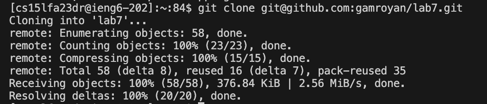
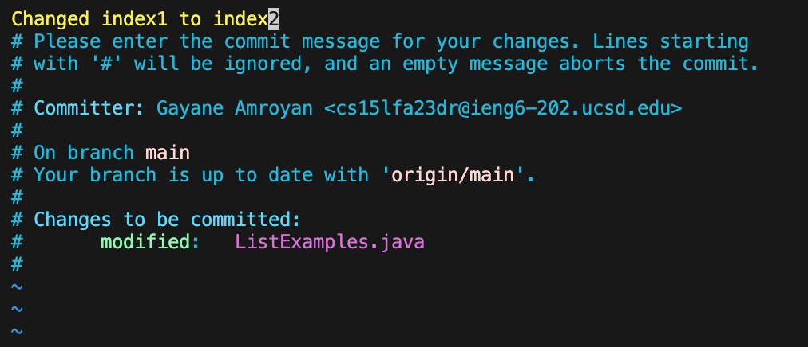

# Lab Report 4 - Vim (Week 7)

## Step 4:


Keys pressed: ```<s><s><h><space><c><s><1><5><l><f><a><2><3><d><r><@><i><e><n><g><6><.><u><c><s><d><.><e><d><u><enter>``` in order to log into ieng6 with my personal account.

## Step 5:


Keys pressed: ```<g><i><t><space><c><l><o><n><e><space><command><V><enter>```. Typed "git clone" and had the link to the GitHub repository copied to my clipboard, so I used ```<command><V>``` to paste it into the terminal. This cloned the repository into the ieng6 server and made a directory called ```lab7```.

## Step 6:


Keys pressed: ```<l><s><enter>``` to list the names of the files and directories within my current directory. I then pressed the keys ```<c><d><space><l><a><b><7><enter>``` in order to change my current directory into ```lab7```. Then pressed ```<b><a><s><h><space><t><e><s><t><.><s><h>``` to run the tests, demonstrating that they all fail.

## Step 7:

Keys pressed: ```<v><i><m><space><shift><L><i><s><t><shift><E><x><a><m><p><l><e><s><.><j><a><v><a><enter>``` to enter Vim to edit the code file ```ListExamples.java''' with the error. 

## Step 8:


## Step 9:



