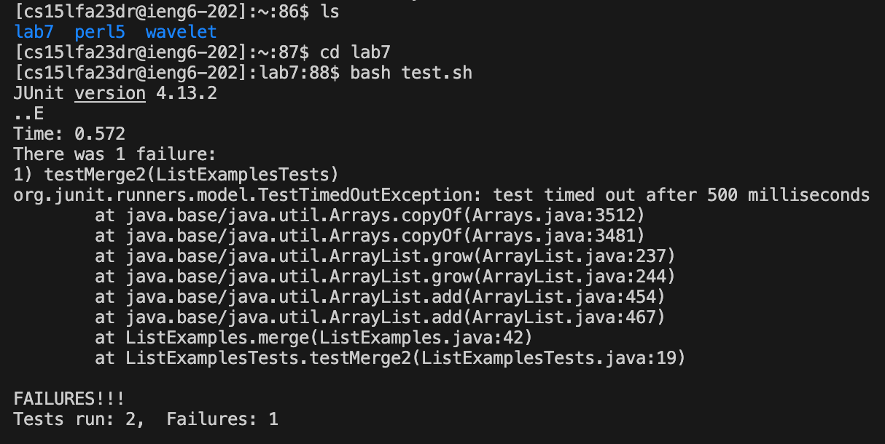

# Lab Report 4 - Vim (Week 7)

## Step 4:


Keys pressed: ```<s><s><h><space><c><s><1><5><l><f><a><2><3><d><r><@><i><e><n><g><6><.><u><c><s><d><.><e><d><u><enter>``` in order to log into ieng6 with my personal account.

## Step 5:


Keys pressed: ```<g><i><t><space><c><l><o><n><e><space><command><V><enter>```. Typed "git clone" and had the link to the GitHub repository copied to my clipboard, so I used ```<command><V>``` to paste it into the terminal. This cloned the repository into the ieng6 server and made a directory called ```lab7```.

## Step 6:


Keys pressed: ```<l><s><enter>``` to list the names of the files and directories within my current directory. I then pressed the keys ```<c><d><space><l><a><b><7><enter>``` in order to change my current directory into ```lab7```. Then pressed ```<b><a><s><h><space><t><e><s><t><.><s><h>``` to run the tests, demonstrating that they all fail.

## Step 7:


Keys pressed: ```<v><i><m><space><shift><L><i><s><t><shift><E><x><a><m><p><l><e><s><.><j><a><v><a><enter>``` to enter Vim to edit the code file ```ListExamples.java''' with the error. 


Keys pressed: ```<ctrl><d><ctrl><d><up><up><up><up><up><up><right><right><right><right><right><right><right><right><right><right><right><x><i><2><esc><:><w><q>```. Upon entering Vim, my cursor was on the top left corner of the file, so I used ```ctrl D``` twice to move the cursor down 1/2 page twice. Then went pressed the up arrow 6 times and the right arrow 11 times to get to the error. Pressed ```x``` to delete the 1 in ```index1```. Then pressed ```i``` to enter insert mode and edited the text by adding 2. This way ```index1``` became ```index2```. I then used ```esc``` to exit insert mode and go back into normal mode. Finally, I used Vim and saved the file using ```:wq```.

## Step 8:


Keys pressed: ```<up><up><enter>```. The ```bash test.sh``` command was 2 up in the search history, so I used the up arrow to access it. they now succeed and the file runs properly.

## Step 9:


### inside Vim: 


Keys pressed: ```<g><i><t><space><a><d><d><space><shift><L><i><s><t><shift><E><x><a><m><p><l><e><s><.><j><a><v><a><enter>``` to stage the file ```ListExamples.java``` to be a part of the next commit. Then I pressed ```<g><i><t><space><c><o><m><m><i><t><enter>``` to save all changes into the local repository, which opened up Vim and prompted me to write a message about the edits. I typed using the keys ```<shift><C><h><a><n><g><e><d><space><i><n><d><e><x><1><space><t><o><space><i><n><d><e><x><2><esc><:><w><q>```, to write out "Changed index1 to index2," pressed ```esc``` to exit insert mode and saved the file using ```:wq```. Then, I used the keys ```<g><i><t><space><p><u><s><h><enter>``` to copy all new commits to GitHub.
