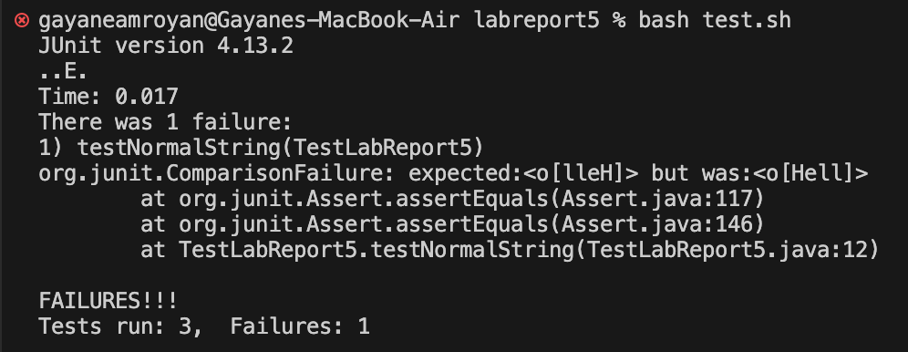
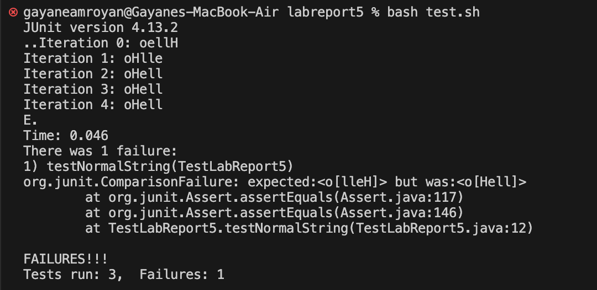

# Lab Report 5 - Putting it All Together (Week 9)

## Part 1 - Debugging Scenario

### Original Post:
**Title:** Strange Behavior in String Reversal Method

**Description:** Hello, I'm working on a lab report and am having a weird issue with my string reversal method. I've attached the relevant code below: 

```java
public class LabReport5 {

    public static String reverseString(String input) {
        if (input == null || input.isEmpty()) {
            return "Input string is null or empty.";
        }

        char[] charArray = input.toCharArray();

        for (int i = 0; i < charArray.length; i++) {
            char temp = charArray[i];
            charArray[i] = charArray[charArray.length - 1];
            charArray[charArray.length - 1] = temp;
        }
        return new String(charArray);
    }
}
```

Here is a JUnit test case that fails:
```java
public class TestLabReport5 {

    @Test
    public void testNormalString() {
        // test with a non-null and non-empty string
        String input = "Hello";
        String expected = "olleH";
        String actual = LabReport5.reverseString(input);
        assertEquals(expected, actual);
    }
}
```


The problem is that when I use ```reverseString```, the output isn't what I expect. It seems like the characters aren't being swapped correctly because the output contains the same set of characters as the input but in a very weird order. I also noticed that the method works perfectly fine when the input string is null or empty, so I suspect there might be a bug in the character-swapping part of my code. 

Just to give you some background, I implemented the reversal by swapping each character in the string with the last character in the array. I thought this would be a straightforward way to reverse the string. I am also using a bash script to compile/run the tests. Can anyone help me figure out what's going wrong here?

### Response from TA:
Hey there! Your approach to swapping characters is interesting.

To narrow down the issue, you could try running your ```reverseString``` method with a simple test case (could be the same one you provided), and print the intermediate results within the loop. By doing so, you can observe the changes in the ```charArray``` at each iteration, which should help us see how the characters are being swapped at each step. For instance, you can add the following lines inside your loop: ``` System.out.println("Iteration " + i + ": " + new String(charArray)); ```.

### Student's Second Attempt:
Adding the line ``` System.out.println("Iteration " + i + ": " + new String(charArray)); ``` returned the output:


Now, looking at how ```charArray``` is being affected after every iteration, I can see that my code always swapped each character with the last character in the array ```charArray[charArray.length - 1]```. This resulted in all characters being swapped with the last one in each iteration, not effectively reversing the string correctly.

Here is my updated code, which reverses strings correctly by symmetrically swapping characters from both ends until reaching the middle of the array. Within the loop, the character at index ```i``` is temporarily stored in the variable ```temp```. Then, the character at index ```i``` is replaced with the character at the symmetric position from the end of the array ```charArray.length - 1 - i```. The character at the symmetric position is then replaced with the temporary variable ```temp```.

```java
public class LabReport5 {

    public static String reverseString(String input) {
        if (input == null || input.isEmpty()) {
            return "Input string is null or empty.";
        }

        char[] charArray = input.toCharArray();

        for (int i = 0; i < charArray.length / 2; i++) {
            char temp = charArray[i];
            charArray[i] = charArray[charArray.length - 1 - i];
            charArray[charArray.length - 1 - i] = temp;
        }
        return new String(charArray);
    }
}
```

### The Setup:
**File and Directory structure:**
```
- Lab Report 5
    - lib
        - hamcrest-core-1.3.jar
        - junit-4.13.2.jar
    - LabReport5.java
    - test.sh
    - TestLabReport5.java
```

**Contents before fixing bug:**
**LabReport5.java**
```java
public class LabReport5 {

    public static String reverseString(String input) {
        if (input == null || input.isEmpty()) {
            return "Input string is null or empty.";
        }

        char[] charArray = input.toCharArray();

        for (int i = 0; i < charArray.length; i++) {
            char temp = charArray[i];
            charArray[i] = charArray[charArray.length - 1];
            charArray[charArray.length - 1] = temp;
        }

        return new String(charArray);
    }
}
```

**test.sh**
```bash
CPATH='.:lib/hamcrest-core-1.3.jar:lib/junit-4.13.2.jar'

set -e

javac -cp $CPATH *.java
java -cp $CPATH org.junit.runner.JUnitCore TestLabReport5 

```

**TestLabReport5.java**
```java
import static org.junit.Assert.*;
import org.junit.*;

public class TestLabReport5 {

    @Test
    public void testNormalString() {
        // test with a non-null and non-empty string
        String input = "Hello";
        String expected = "olleH";
        String actual = LabReport5.reverseString(input);
        assertEquals(expected, actual);
    }

    @Test
    public void testEmptyString() {
        // test with an empty string
        String input = "";
        String expected = "Input string is null or empty.";
        String actual = LabReport5.reverseString(input);
        assertEquals(expected, actual);
    }

    @Test
    public void testNullString() {
        // test with a null string
        String original = null;
        String expected = "Input string is null or empty.";
        String actual = LabReport5.reverseString(original);
        assertEquals(expected, actual);
    }
 }
```

**The full command line (or lines) you ran to trigger the bug**

**A description of what to edit to fix the bug**

## Part 2 - Reflection
Throughout the second half of this quarter, I learned how versatile it is to work from the terminal. One part of the class that stood out to me was how we could access, manipulate/edit, and even push files to GitHub directly from the command line. Previously, I hadn't known that it was possible to navigate GitHub without relying on a graphical interface. Also, working with Vim to edit files was cool to learn about. Logging into the ieng6 computer remotely was definitely a highlight of the quarter since I had never done something like that before. I can see how the skills we learned in this lab will be very useful in any future software-related endeavors.

